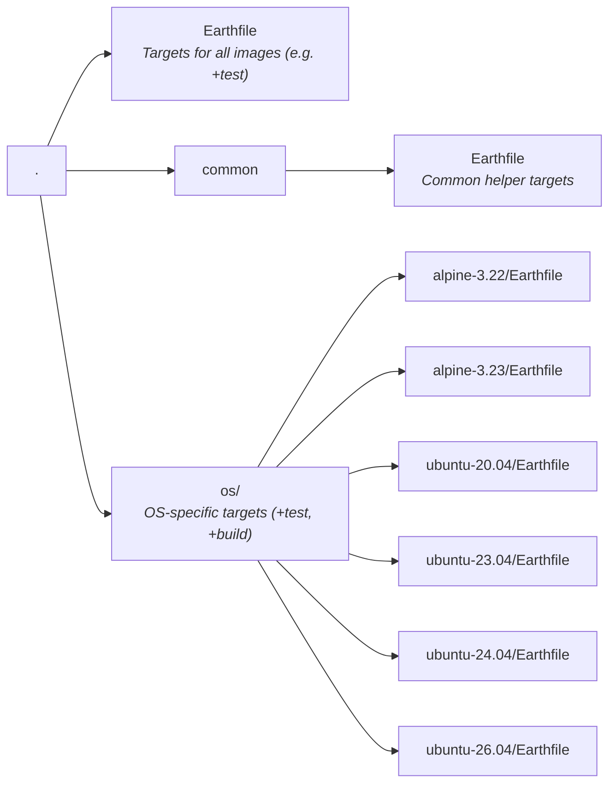

# Contributing

## Code of Conduct

Please refer to the [CNCF Community Code of Conduct v1.0](https://github.com/cncf/foundation/blob/main/code-of-conduct.md)

## How Images are Built

In this repository, we maintain the OS & Docker versions that warrants releasing a new version of the image.
However, the installations of docker and other dependencies are done via an installation script that is currently maintained in [earthbuild/earthbuild](https://github.com/earthbuild/earthbuild).

### Dependencies

Dependencies are maintained by Renovate and will be merged automatically (provided required checks pass), primarily
dependencies that will trigger new versions of the dind images such as the docker or the os (alpine) versions.

## Repo structure



## Testing

Images are tested by running remote test targets that are maintained in [earthbuild/earthbuild](https://github.com/earthbuild/earthbuild/tree/main/tests/with-docker). This is because these tests also help test [WITH DOCKER](https://docs.earthly.dev/docs/earthfile#with-docker) command in earth cli.

Temporary images are built, pushed, and pulled as part of the test cycle.

### How to run tests

- Test a specific image os:

```bash
earth --push -P ./os/<os>+test-build
```

- Test all images:

```bash
earth --push -P +test
```

#### Community members

Community members do not have permissions to push a built image and run the tests against it. However, they can easily set a different container registry repository by changing the `CR_HOST` (default: ghcr.io) and `CR_ORG` ARG values in [.arg](.arg) to a private container registry repository or by passing the args in the earth command, e.g. `earth --push -P +test --CR_HOST=<your-container-registry> --CR_ORG=<your-organization>`.

## Deployment

When the relevant dependencies are updated by Renovate, new images/tags will be pushed automatically to the container registries - [ghcr.io/earthbuild/dind](https://ghcr.io/earthbuild/dind) and [earthbuild/dind](https://hub.docker.com/r/earthbuild/dind).

## Contributing

- Please report bugs as [GitHub issues](https://github.com/earthbuild/dind/issues).
- Join us on [Slack](https://earthly.dev/slack)!
- Questions via GitHub issues are welcome!
- PRs welcome! But please give a heads-up in a GitHub issue before starting work. If there is no GitHub issue for what you want to do, please create one.

## Licensing

Earthly is licensed under the Mozilla Public License Version 2.0. See [LICENSE](./LICENSE).
